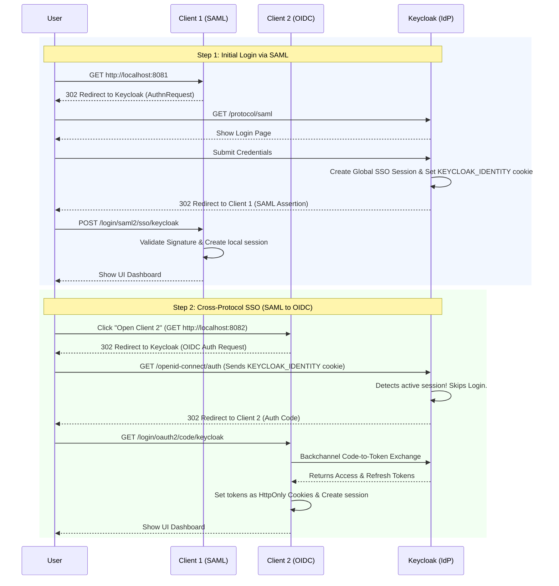

# Cross-Protocol Single Sign-On (SAML to OIDC)

This repository demonstrates a robust Identity and Access Management implementation executing **Cross-Protocol Single Sign-On (SSO)** utilizing Keycloak as the central Identity Provider (IdP). 

It features two Spring Boot microservices:
1. **Client 1 (`client1-saml`)**: Operates on port `8081` using the legacy **SAML 2.0** protocol.
2. **Client 2 (`client2-oidc`)**: Operates on port `8082` using the modern **OpenID Connect (OIDC)** protocol.

---

## 1. How Initial Authentication Happens (SAML Flow)

When an unauthenticated user first visits the environment, the following sequence occurs:

1. **The Intercept**: The user navigates to `http://localhost:8081`. Spring Security notices the user is unauthenticated.
2. **The AuthnRequest**: Spring Boot dynamically generates a Base64-encoded SAML Authentication Request (`AuthnRequest`), and issues an HTTP 302 Redirect, sending the user to Keycloak's `/protocol/saml` endpoint.
3. **The Login**: Keycloak detects the user has no active session and presents the standard HTML login screen.
4. **The Global Session**: The user enters their credentials. Once validated, Keycloak establishes a **Central SSO Session** on the `sso-realm` and drops a secure session cookie on the user's browser (named `KEYCLOAK_IDENTITY`).
5. **The Assertion**: Keycloak signs a SAML Assertion containing the user's details and redirects the user back to Client 1's Assertion Consumer Service (ACS) endpoint via an HTTP POST.
6. **The Local Session**: Client 1 verifies the cryptographic signature of the SAML Assertion, extracts the user details, creates its own local Spring Security Session (`JSESSIONID`), and displays the UI.

---

## 2. Transitioning Between Clients (Cross-Protocol Magic)

When the user is logged into Client 1 and clicks the **"Open Client 2"** button, the beautiful Cross-Protocol SSO flow initiates:

1. **The Intercept (Again)**: The user's browser navigates to `http://localhost:8082`. Because Client 2 uses OIDC and has no shared session with Client 1, Spring Security intercepts the request.
2. **The OIDC Auth Request**: Client 2 issues a standard OIDC Authorization Request (redirecting the user to Keycloak's `/protocol/openid-connect/auth` endpoint).
3. **The SSO Bypass (The Magic)**: When the user's browser hits Keycloak, the browser automatically sends along the `KEYCLOAK_IDENTITY` cookie established during the SAML login. Keycloak reads this cookie, recognizes the active Global SSO Session, and **instantly skips the login screen**. 
4. **The Issuance**: Keycloak seamlessly transitions the user context from SAML to OIDC, issues an OIDC Authorization Code, and instantly redirects the user back to Client 2.
5. **The Backchannel Exchange**: Client 2's backend takes the Authorization Code and silently makes a back-channel HTTP POST request to Keycloak's `/token` endpoint, swapping the code for a set of OIDC Tokens (`access_token`, `id_token`, and `refresh_token`).
6. **The Custom Cookie Handler**: Our custom `TokenCookieSuccessHandler` in Client 2 intercepts these tokens and securely injects the `access_token` and `refresh_token` into the HTTP Response as `HttpOnly` Set-Cookie headers. 
7. **Complete**: The user sees the Client 2 UI, having jumped protocols without typing a single password!

---

## 3. Token Validation & Background Refresh

In Client 2, we implemented an explicit mechanism to validate and automatically refresh tokens via the `/api/validate` endpoint:

1. Spring Security natively tracks the Expiration timestamp (`exp`) of the Access Token inside the `OAuth2AuthorizedClientService`.
2. When the user clicks "Validate Token", the browser makes an AJAX request to `/api/validate`.
3. If the token is natively expired, the backend grabs the `OAuth2AuthorizedClientManager` and initiates a **Refresh Token Grant** directly with Keycloak. 
4. Keycloak issues a brand new Access Token. The Spring Boot backend securely overwrites the browser's cookies with the new data and responds with a success message, maintaining the user's session infinitely without UI interruption.

---

## Architecture Sequence Diagram

